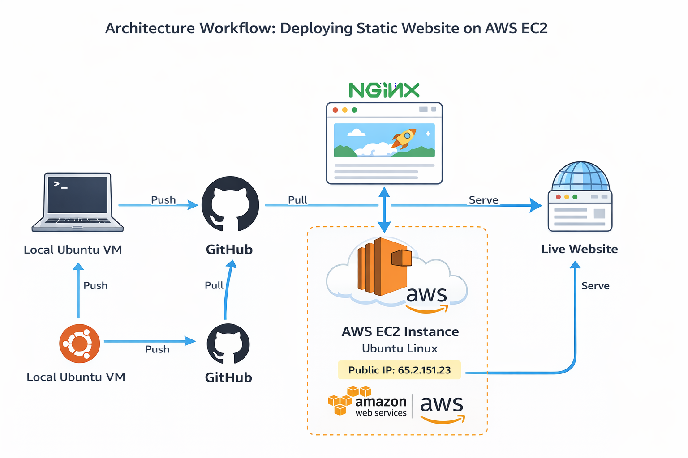
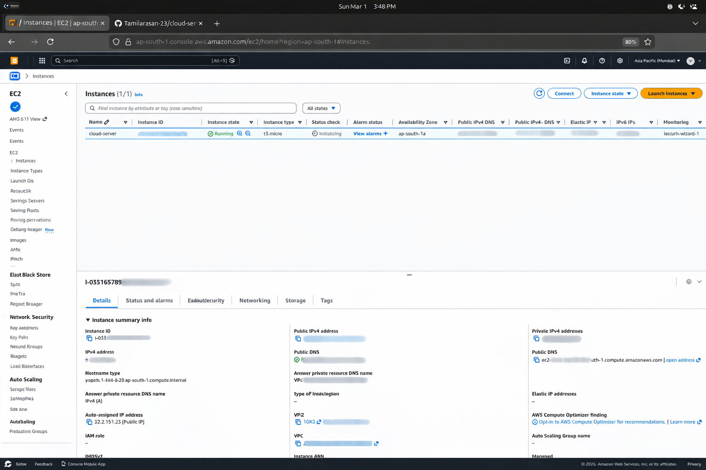

# 🚀 Cloud Web Server Deployment on AWS EC2

This project demonstrates how to deploy a static website on a cloud server using AWS EC2, Nginx, and GitHub.

The website is hosted on a public IP and is accessible over the internet.

---

## 📌 Project Overview

In this project, I:

- Developed a static website using HTML
- Managed source code using Git and GitHub
- Launched an Ubuntu EC2 instance on AWS
- Connected to the server using SSH key authentication
- Installed and configured Nginx web server
- Deployed the website on a live cloud server

This project helped me understand real-world Cloud and DevOps workflows.

---

## 🛠️ Tech Stack

- Ubuntu Linux (Local VM & EC2)
- Git & GitHub
- AWS EC2
- Nginx Web Server
- HTML

---

## 🏗️ Architecture Workflow

### Workflow Steps:

1. Code is developed on Local Ubuntu VM
2. Code is pushed to GitHub repository
3. AWS EC2 pulls code from GitHub
4. Nginx serves the website
5. Website is accessed using Public IP

---

## 🌍 Live Demo

🔗 http://65.2.151.23

---

## 🖥️ EC2 Instance Running

---

## 🌍 Live Website

---

## ⚙️ Deployment Steps

### 1️⃣ Clone Repository
git clone https://github.com/Tamilarasan-23/cloud-server-projectEC2.git

👨‍💻 Author

Tamilarasan S
Aspiring Cloud / DevOps Engineer

GitHub: https://github.com/Tamilarasan-23

LinkedIn: https://www.linkedin.com/in/tamilarasan23?utm_source=share&utm_campaign=share_via&utm_content=profile&utm_medium=android_app
